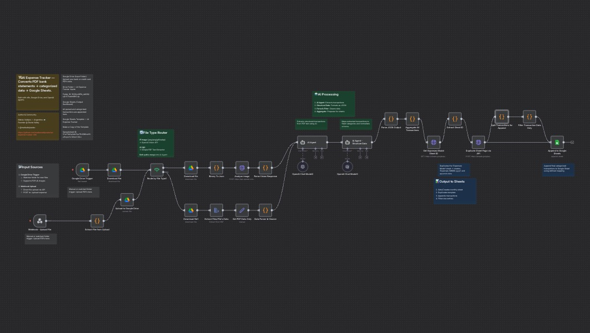

# 💸 AI Expense Tracker — n8n + Google Drive + Sheets

[](https://x.com/mativallejosdev)
[](https://github.com/matiasvallejosdev/ai-expense-tracker-n8n/search?l=json)


> Automatically extract and organize expenses from bank statement PDFs into Google Sheets using AI, n8n, and Google Drive.



## 📘 Introduction

**AI Expense Tracker** is a low-code automation built with **n8n** that leverages **OpenAI**, **Google Drive**, and **Google Sheets** to automate personal finance tracking.

Just upload your **bank statement PDF**, and the workflow will:

1. Extract the data using AI.
2. Categorize each expense intelligently.
3. Append the results to a structured Google Sheet dashboard.

Inspired by *“El Hombre Más Rico de Babilonia”* and *“La Bolsa o la Vida”*, this project promotes financial awareness and digital independence through automation.

## ✨ Key Features

- **Google Drive Integration** – Drop your bank statement PDFs into a folder, and the system takes it from there.
- **AI-Powered Parsing** – Uses GPT-4o to read and structure your expenses into JSON.
- **Categorization Agent** – Classifies expenses into fixed categories (Supermarket, Gastronomy, etc.).
- **Automatic Google Sheets Sync** – Generates a new “Expenses {Month}” tab and appends all transactions.
- **Open Source** – Fully local, no external servers, and zero maintenance cost.

## ⚙️ Quick Start (No-Code)

### Prerequisites
- [n8n](https://n8n.io/) installed locally.
- A [Google Cloud Project](https://console.cloud.google.com/) with:
  - **Google Drive API** enabled.
  - **Google Sheets API** enabled.
- A Google Sheet based on the provided template (`/templates/balance.xlsx`).

### Steps

1. **Clone the repository**
   ```bash
   git clone https://github.com/matiasvallejosdev/ai-expense-tracker-n8n.git
   cd ai-expense-tracker-n8n
   ```
2. **Import the workflow**
   * Go to your local [n8n dashboard](http://localhost:5678).
   * Import `/n8n/ai-expense-tracker-n8n.json`.
3. **Configure credentials**
   * In *n8n → Credentials*, create:
     * `Google Drive OAuth2`
     * `Google Sheets OAuth2`
   * Use the redirect URI:
     ```
     http://localhost:5678/rest/oauth2-credential/callback
     ```
   * Follow Google’s guide for OAuth setup:
     [Create OAuth Client ID](https://developers.google.com/workspace/guides/create-credentials#oauth-client-id)
4. **Connect your template**
   * Upload the provided `/templates/balance.xlsx` to your Google Drive.
   * Rename it if you wish, but keep a tab named **“Expenses Model”**.
5. **Set your folder trigger**
   * In the workflow, edit the node **Google Drive Trigger** and replace the folder ID with your own.
6. **Run it**
   * Upload a PDF statement into that folder.
   * Watch your Google Sheet auto-populate with parsed transactions!

### 🗂️ Google Drive Folder (Input)
This is where you should upload your bank statement PDFs.
📁 [Open the Drive Folder](https://drive.google.com/drive/folders/16G0cnl6PA_ds68Q-sj4-E71sdmt8K0Jp?usp=sharing)

Each file you drop there (e.g. `statement_visa.pdf`) will trigger the workflow and automatically process it.

### 📊 Google Sheets Template (Output)
All categorized data will be appended automatically to this Google Sheets template:
📈 [Open the Google Sheets Template](https://docs.google.com/spreadsheets/d/1CxrFIACqAUA7uu7fivSMhzzHtaIfcpxcIVr4NxnCObo/edit?usp=sharing)

Or click **[Make a Copy](https://docs.google.com/spreadsheets/d/1CxrFIACqAUA7uu7fivSMhzzHtaIfcpxcIVr4NxnCObo/copy)** to create your own editable version.

## 🧩 Detailed Setup (Developers)

For more control or to debug:

1. **Customize Agents**
   * `AI Agent` → parses raw text from PDF.
   * `AI Agent – Structure Data` → converts it into a valid JSON array.

2. **Processing Flow**
   * Google Drive Trigger → Download PDF → Extract Text → AI Parse → JSON Normalize → Filter Transactions → Append to Sheet.

3. **Script Filters**
   * Automatically ignores tax lines (`IVA`, `Percepciones`, `Impuesto de Sellos`, etc.) and USD duplicates.

4. **Output Schema**
   | Field            | Type   | Description                           |
   | ---------------- | ------ | ------------------------------------- |
   | `Month`          | string | Month extracted from transaction date |
   | `Date`           | string | ISO date (YYYY-MM-DD)                 |
   | `Concept`        | string | Transaction detail                    |
   | `Payment_Method` | string | Credit Card / Debit Card / Cash       |
   | `Category`       | string | Expense category                      |
   | `Amount`         | number | Value of transaction                  |
   | `Currency`       | string | ARS / USD                             |

## 📊 Data Model

**Fixed Taxonomy**

| **Currency** | **Payment Method**            | **Expense Categories**                                                                          | **Income Categories**                            |
| ------------ | ----------------------------- | ----------------------------------------------------------------------------------------------- | ------------------------------------------------ |
| ARS, USD     | Credit Card, Debit Card, Cash | Supermarket, Gastronomy, Services, Fashion, Transport, Technology, Home, Education, Sports, ... | Salary, Freelancing, Investment, Business, Extra |

You can extend these categories directly in the **AI prompts** or in the **Google Sheet data validation lists**.

## 🤖 Workflow Overview

1. **Google Drive Trigger** → watches a specific folder.
2. **Download PDF** → fetches new statements.
3. **Extract File Data** → converts PDF to text.
4. **Data Parser & Cleaner** → formats the text.
5. **AI Agent (GPT-4o)** → extracts transactions.
6. **AI Agent – Structure Data** → converts to JSON array.
7. **Parse JSON Output** → validates structure.
8. **Aggregate → Duplicate Sheet → Append to Sheet** → final output in your balance template.

> Everything runs locally on your machine through your n8n instance — your data stays 100% private.

## 💡 Usage

* Upload PDF → Wait for execution → Open your **Google Sheet**.
* The system auto-creates a new sheet for each month:

  ```
  Expenses Oct 2025
  ```
* Filter, analyze, or connect to dashboards.
* Works perfectly with the included balance template dashboard.

## 🤝 Contributing

Contributions are welcome!
If you want to improve parsing logic, add new categories, or optimize the workflow:

1. Fork the repository.
2. Create a feature branch.
3. Commit and push your changes.
4. Open a Pull Request.

Make sure to include a **redacted PDF example** if your update changes extraction logic.

## 📞 Contact

If you have questions, suggestions, or want to collaborate:

- **Name:** Matías Vallejos
- 🌐 [matiasvallejos.com](https://matiasvallejos.com)
- 𝕏 [@mativallejosdev](https://x.com/mativallejosdev)

## 📄 License

This project is open source and available under the [MIT License](LICENSE).

## 🧠 Inspiration

> “Control your money, or your money will control you.” — *La Bolsa o la Vida*

> “Start thy purse to fattening.” — *El Hombre Más Rico de Babilonia*
